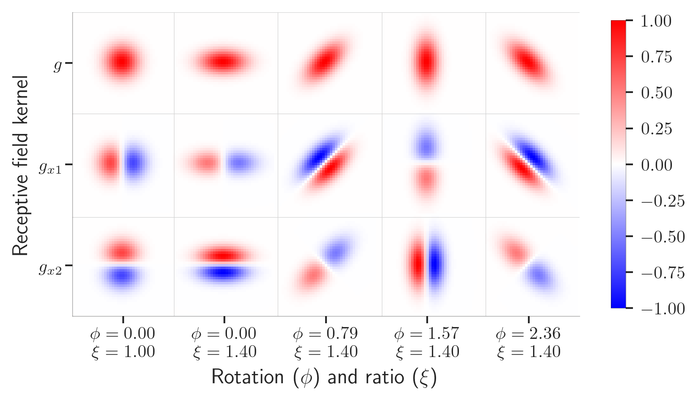
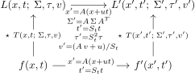
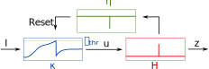
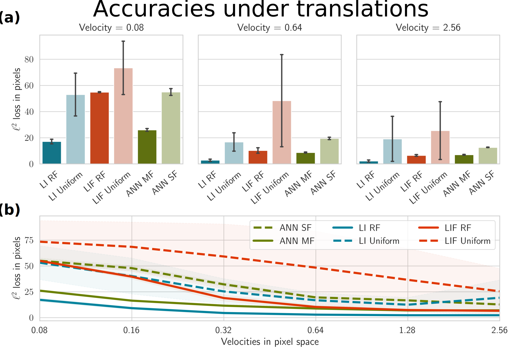

<link rel="stylesheet" href="https://cdn.jsdelivr.net/npm/katex@0.10.2/dist/katex.min.css" integrity="sha384-yFRtMMDnQtDRO8rLpMIKrtPCD5jdktao2TV19YiZYWMDkUR5GQZR/NOVTdquEx1j" crossorigin="anonymous">
<script defer src="https://cdn.jsdelivr.net/npm/katex@0.10.2/dist/katex.min.js" integrity="sha384-9Nhn55MVVN0/4OFx7EE5kpFBPsEMZxKTCnA+4fqDmg12eCTqGi6+BB2LjY8brQxJ" crossorigin="anonymous"></script>
<script defer src="https://cdn.jsdelivr.net/npm/katex@0.10.2/dist/contrib/auto-render.min.js" integrity="sha384-kWPLUVMOks5AQFrykwIup5lo0m3iMkkHrD0uJ4H5cjeGihAutqP0yW0J6dpFiVkI" crossorigin="anonymous" onload="renderMathInElement(document.body);"></script>


# Covariant spatio-temporal receptive fields for neuromorphic computing

[](https://arxiv.org/abs/2405.00318)


[Neuromorphic computing](https://en.wikipedia.org/wiki/Neuromorphic) exploits the laws of physics to perform computations, similar to the human brain.
If we can "lower" the computation into physics, we achieve **extreme energy gains**, [up to 27-35 orders of magnitude](https://ieeexplore.ieee.org/document/10363573).
So, why aren't we doing that? Presently, we *lack theories to guide efficient implementations*. 
We can build the circuits, but we don't know how to combine them to achieve what we want.
[Current neuromorphic models cannot compete with deep learning](https://www.nature.com/articles/s43588-021-00184-y).

Here, **we provide a principled computational model for neuromorphic systems** based on tried-and-tested spatio-temporal covariance properties.
We demonstrate superior performance for simple neuromorphic primitives in an [event-based vision](https://en.wikipedia.org/wiki/Event_camera) task compared to naïve artificial neural networks.
The direction is exciting to us because

1. We define mathematically coherent covariance properties, which are required to correctly handle signals in space and time,
2. Use neuromorphic primitives (leaky integrator and leaky integrate-and-fire models) to outcompete a non-neuromorphic neural network, and
3. Our results have immediate relevance in signal processing and event-based vision, with the possibility to extend to other tasks over space and time, such as memory and control.

## What is a **spatial** receptive field?

A spatial receptive field can be thought of as a kernel that `pattern matches' the incoming signal.
Formally, it is [the convolution integral](https://en.wikipedia.org/wiki/Convolution) of the input signal with a kernel \\(k\\).

$$
(f \star g) (t) = \int_{-\infty}^{\infty} f(\tau) g(t - \tau) d\tau
$$

In our case, we use [Gaussian derivatives](https://en.wikipedia.org/wiki/Gaussian_function), which are a [heavily exploited in biological vision](https://www.sciencedirect.com/science/article/pii/S2405844021000025).
Gaussian kernels are also known to be covariant to affine transformations if we parameterize them correctly, that is, rotates, stretches, and derives them in various ways to accurately match all the possible types of transformations in the image plane.
Below you see some examples of spatial receptive fields, where a gaussian kernel (upper left) is derived in two axes (rows 1 and 2), as well as skewed and rotated (columns 2 to 5).
Each kernel will provide a unique response to the input signal, which exactly codes for the transformation in the image plane.



## What is a **temporal** receptive field?
In time, this looks a little different.
First, we have a **causality assumption**. We cannot integrate from \\(-\inft\\) to \\(\infty\\) in time, because we don't know the future.

$$
(f \star g) (t) = \int_{0}^{\infty} f(\tau) g(t - \tau) d\tau
$$

That limits our choice of \\(g\\), and we instead have to integrate with an *exponentially truncated* kernel like the video below

$$
h(t;\, \mu) = \begin{cases} \mu^{-1}\exp(-t/\mu) & t \gt 0 \\ 0 & t \leqslant 0 \end{cases}
$$


<video src="conv_li2.mp4" autoplay loop style="max-width: 100%;"></video>


Imagine applying this kernel to a moving object in time.
If the time constant \\(\mu\\) is large, the kernel will <q>smear</q> out the signal over time, similar to the video below

<video src="conv_li.mp4" autoplay loop style="max-width: 100%;"></video>

This is a pattern matching operation in time, similar to the spatial case.

## Combining spatial and temporal receptive fields

Thanks to the excellent work by [Tony Lindeberg](https://www.kth.se/profile/tony/) on scale-space theory (see in particular [this publication on normative receptive fields](https://www.sciencedirect.com/science/article/pii/S2405844021000025)), we have a principled way to combine the covariance properties of the spatial and temporal receptive fields.

Concretely, we both want the spatial (\\(x\\)) and temporal (\\(t\\)) signal subject to some spatial transformation \\(A\\) and temporal scaling operation \\(S_t\\) to be covariant under a given scale-space representation \\(L\\).



## Neuromophic spatio-temporal receptive fields

The main message of our paper is the fact that we can get exactly this spatio-temporal covariance property by using neuromorphic neuron models.
This works for the leaky integrator, because it is exactly a truncated exponential kernel.
More generally, we show that the [Spike Response Model](http://scholarpedia.org/article/Spike-response_model) (SRM) that presents computational neuron models as linearized systems exhibit the same covariance properties, even though the output can be truncated as binary spikes.



With that, we train our model on a [generated event dataset](https://github.com/ncskth/event-generator) that simulates moving geometric shapes in time with varying velocity.
The less velocity, the sparser the signal.
To a point where the signal is so sparse it is impossible to track the objects with the human eye.

The below figure shows the performance of our model compared to a non-neuromorphic neural network with ReLU units.
The leaky integrator (LI) and the leaky integrate-and-fire (LIF) models outperform the ReLU network in most cases.
Even the ReLU network that has access to multiple frames in the past (multi-frame (MF) vs single-frame (SF)).

For context, the sparse setting (velocity = 0.08) generates about 3-4 shape-related activations per time step, against a backdrop of about 500 activations related to noise.




## Acknowledgements
The authors gratefully acknowledge support from the EC Horizon 2020 Framework
Programme under Grant Agreements 785907 and 945539 (HBP), the Swedish Research Council under contracts 2022-02969 and 2022-06725, and the Danish National Research Foundation grant number P1.

## Citation
Our work is available as a preprint at [arXiv:2405.00318](https://arxiv.org/abs/2405.00318) and can be cited as follows
```bibtex
@misc{pedersen2024covariant,
      title={Covariant spatio-temporal receptive fields for neuromorphic computing}, 
      author={Jens Egholm Pedersen and Jörg Conradt and Tony Lindeberg},
      year={2024},
      eprint={2405.00318},
      archivePrefix={arXiv},
      primaryClass={cs.NE}
}
```